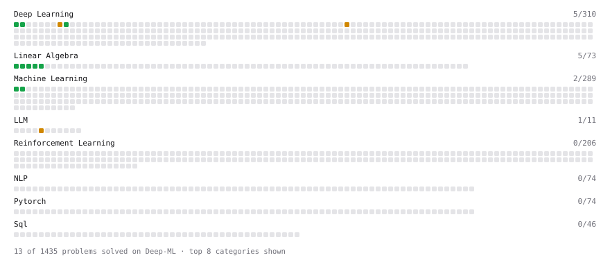

# Deep-ML

My machine learning practice from [Deep-ML](https://www.deep-ml.com). Every solution here was written by hand.

**34** solved · 34 problems · 0 labs · 0 math

[**Browse the interactive portfolio**](https://ghostwarhawk17.github.io/deep-ml/) to replay this filling in over time.

## Problems

| | Difficulty | Solved | |
| --- | --- | --- | --- |
| [Calculate Mean by Row or Column](https://www.deep-ml.com/problems/4) | easy | 2025-06-25 | [solution](problems/0004-calculate-mean-by-row-or-column) |
| [Calculate Perplexity for Language Models](https://www.deep-ml.com/problems/320) | easy | 2026-09-04 | [solution](problems/0320-calculate-perplexity-for-language-models) |
| [Calculate Unigram Probability from Corpus](https://www.deep-ml.com/problems/129) | easy | 2026-09-04 | [solution](problems/0129-calculate-unigram-probability-from-corpus) |
| [Create a Float Tensor from a Python List](https://www.deep-ml.com/problems/880) | easy | 2026-09-05 | [solution](problems/0880-create-a-float-tensor-from-a-python-list) |
| [Duplicated N-gram Coverage Ratio](https://www.deep-ml.com/problems/772) | easy | 2026-09-06 | [solution](problems/0772-duplicated-n-gram-coverage-ratio) |
| [Exact Match Score with Normalization](https://www.deep-ml.com/problems/325) | easy | 2026-09-04 | [solution](problems/0325-exact-match-score-with-normalization) |
| [Implement ReLU Activation Function](https://www.deep-ml.com/problems/42) | easy | 2026-01-17 | [solution](problems/0042-implement-relu-activation-function) |
| [Linear Regression Using Gradient Descent](https://www.deep-ml.com/problems/15) | easy | 2026-01-18 | [solution](problems/0015-linear-regression-using-gradient-descent) |
| [Linear Regression Using Normal Equation](https://www.deep-ml.com/problems/14) | easy | 2026-01-17 | [solution](problems/0014-linear-regression-using-normal-equation) |
| [Matrix-Vector Dot Product](https://www.deep-ml.com/problems/1) | easy | 2025-06-14 | [solution](problems/0001-matrix-vector-dot-product) |
| [Min-Max Scaling of Feature Values](https://www.deep-ml.com/problems/112) | easy | 2026-09-03 | [solution](problems/0112-min-max-scaling-of-feature-values) |
| [Reshape Matrix](https://www.deep-ml.com/problems/3) | easy | 2025-06-25 | [solution](problems/0003-reshape-matrix) |
| [Row-Normalize a Count Matrix to Probabilities](https://www.deep-ml.com/problems/985) | easy | 2026-09-03 | [solution](problems/0985-row-normalize-a-count-matrix-to-probabilities) |
| [Scalar Multiplication of a Matrix](https://www.deep-ml.com/problems/5) | easy | 2026-07-29 | [solution](problems/0005-scalar-multiplication-of-a-matrix) |
| [Sigmoid Activation Function Understanding](https://www.deep-ml.com/problems/22) | easy | 2026-07-29 | [solution](problems/0022-sigmoid-activation-function-understanding) |
| [Softmax Activation Function Implementation ](https://www.deep-ml.com/problems/23) | easy | 2026-07-29 | [solution](problems/0023-softmax-activation-function-implementation) |
| [Transpose of a Matrix](https://www.deep-ml.com/problems/2) | easy | 2025-06-14 | [solution](problems/0002-transpose-of-a-matrix) |
| [BLEU Score for Text Generation](https://www.deep-ml.com/problems/321) | medium | 2026-09-03 | [solution](problems/0321-bleu-score-for-text-generation) |
| [BM25 Ranking ](https://www.deep-ml.com/problems/90) | medium | 2026-09-03 | [solution](problems/0090-bm25-ranking) |
| [Byte Pair Encoding (BPE) Tokenizer](https://www.deep-ml.com/problems/380) | medium | 2026-09-04 | [solution](problems/0380-byte-pair-encoding-bpe-tokenizer) |
| [Handle Imbalanced Data with SMOTE](https://www.deep-ml.com/problems/357) | medium | 2026-09-03 | [solution](problems/0357-handle-imbalanced-data-with-smote) |
| [Handle Missing Data with Imputation](https://www.deep-ml.com/problems/354) | medium | 2026-09-03 | [solution](problems/0354-handle-missing-data-with-imputation) |
| [Implement Focal Loss](https://www.deep-ml.com/problems/915) | medium | 2026-09-05 | [solution](problems/0915-implement-focal-loss) |
| [Implement TF-IDF (Term Frequency-Inverse Document Frequency)](https://www.deep-ml.com/problems/60) | medium | 2026-09-03 | [solution](problems/0060-implement-tf-idf-term-frequency-inverse-document-frequency) |
| [Million-Token Corpus Question Answering Evaluation](https://www.deep-ml.com/problems/763) | medium | 2026-09-05 | [solution](problems/0763-million-token-corpus-question-answering-evaluation) |
| [Multi-Needle Long-Context Retrieval Evaluation](https://www.deep-ml.com/problems/753) | medium | 2026-09-04 | [solution](problems/0753-multi-needle-long-context-retrieval-evaluation) |
| [Multi-Token Prediction Training Objective](https://www.deep-ml.com/problems/745) | medium | 2026-09-06 | [solution](problems/0745-multi-token-prediction-training-objective) |
| [N-gram Overlap Contamination Detection](https://www.deep-ml.com/problems/767) | medium | 2026-09-06 | [solution](problems/0767-n-gram-overlap-contamination-detection) |
| [Outlier Detection and Removal Using IQR Method](https://www.deep-ml.com/problems/355) | medium | 2026-09-03 | [solution](problems/0355-outlier-detection-and-removal-using-iqr-method) |
| [Overlapping Max Pooling](https://www.deep-ml.com/problems/190) | medium | 2026-01-17 | [solution](problems/0190-overlapping-max-pooling) |
| [Pairwise Preference Judge for LLM Comparison](https://www.deep-ml.com/problems/323) | medium | 2026-01-16 | [solution](problems/0323-pairwise-preference-judge-for-llm-comparison) |
| [Simple Convolutional 2D Layer](https://www.deep-ml.com/problems/41) | medium | 2026-01-16 | [solution](problems/0041-simple-convolutional-2d-layer) |
| [Weighted Multi-Head Index Score Computation](https://www.deep-ml.com/problems/737) | medium | 2026-09-05 | [solution](problems/0737-weighted-multi-head-index-score-computation) |
| [MinHash for Near-Duplicate Document Detection](https://www.deep-ml.com/problems/766) | hard | 2026-09-05 | [solution](problems/0766-minhash-for-near-duplicate-document-detection) |

---

_This file is regenerated by Deep-ML on every push._
